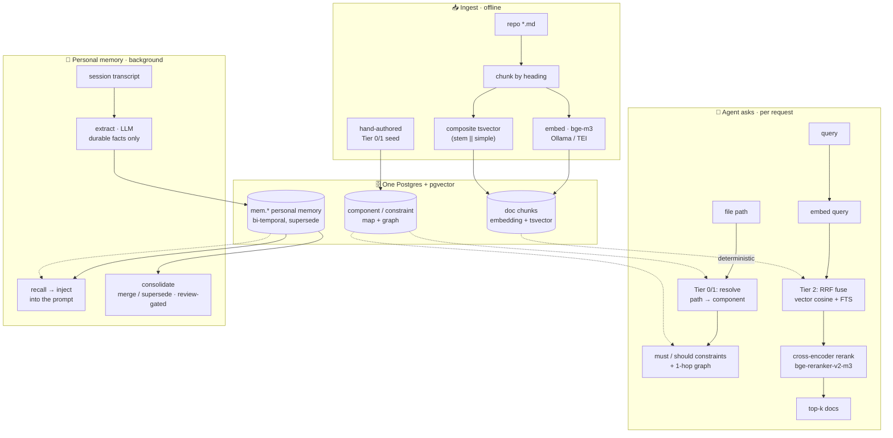

# HyperMnesia

[](https://github.com/Recluse/HyperMnesia/actions/workflows/ci.yml)
[](LICENSE)

*The opposite of amnesia* (Greek *hypermnesia* — abnormally complete recall). Self-hosted long-term
memory for AI coding agents — a
Postgres-backed store that gives an agent (Claude Code, or any MCP client) two things:

1. **Architectural memory (doc-RAG + Tier 0/1)** — your repos' docs made searchable, plus a
   deterministic *component -> constraint* model so the agent knows the rules that apply to a
   file **before** it edits, without a search.
2. **Personal memory** — durable facts/preferences/decisions distilled from work sessions and
   injected back automatically, so the agent stops re-learning the same things every session.

One store (Postgres + [pgvector](https://github.com/pgvector/pgvector)), local-model friendly
(embeddings via [Ollama](https://ollama.com) or [TEI](https://github.com/huggingface/text-embeddings-inference)),
MCP-native, no cloud dependency. Runs on a laptop, one server, or Kubernetes.

> Not a vector-DB wrapper. The value is the **delivery**: deterministic constraint injection
> (Tier 1) and hook-driven personal-memory capture/recall — "storage is solved, injection isn't."

## How it works



- **Tier 2 search** fuses dense (bge-m3 embeddings, HNSW) and lexical (composite `tsvector`,
  works for code identifiers and non-English) via **Reciprocal Rank Fusion**, then an optional
  **cross-encoder reranker** ([bge-reranker-v2-m3](https://huggingface.co/BAAI/bge-reranker-v2-m3))
  reorders the top candidates (measured +0.16 recall@1 on our eval set).
- **Personal memory** is bi-temporal (event time vs ingestion time), **supersede-not-overwrite**
  (corrections don't destroy history), with an abstention gate (an irrelevant query returns
  nothing, not noise). A background pass consolidates near-duplicates; low-confidence merges wait
  in a review queue for you.
- **Capture/recall** run as Claude Code hooks: session profile injected at start, relevant
  memories injected per prompt, transcripts distilled to memories by a small LLM on a schedule.

## Components

| Path | What |
|------|------|
| `sql/` | schema: doc-RAG (`documents/components/constraints/relationships/chunks`) + personal memory (`mem.*`) |
| `ingest/` | markdown chunker, embedder (Ollama/TEI), hybrid RRF search, `mem_ops` |
| `rerank/` | optional cross-encoder reranker service + search orchestrator |
| `hooks/` | Claude Code hooks: profile inject, per-prompt recall, capture, extract, consolidate |
| `mcp-server/` | Rust MCP server exposing project map / constraints / search / memory tools |
| `deploy/` | docker-compose (single box) + Kubernetes manifests |
| `examples/` | an example structural-tier seed for a project |

## Install

See **[docs/INSTALL.md](docs/INSTALL.md)** for the four deployment options (laptop, single
server, Kubernetes, CPU-only-minimal) and the hardware / OS / software requirements table.

TL;DR (single box):

```bash
cp deploy/docker/.env.example deploy/docker/.env   # edit
docker compose -f deploy/docker/docker-compose.yml up -d
psql "$DATABASE_URL" -f sql/schema.sql -f sql/schema_mem.sql
python ingest/ingest_repo.py /path/to/your/repo myrepo out.sql && psql "$DATABASE_URL" -f out.sql
python ingest/embed_chunks.py     # fill embeddings
```

## Design docs

- [docs/DESIGN.md](docs/DESIGN.md) — architecture and the reasoning behind the tiers.
- [docs/MEMORY.md](docs/MEMORY.md) — the personal-memory model (bi-temporal, supersede, consolidation).

## License

MIT — see [LICENSE](LICENSE).
