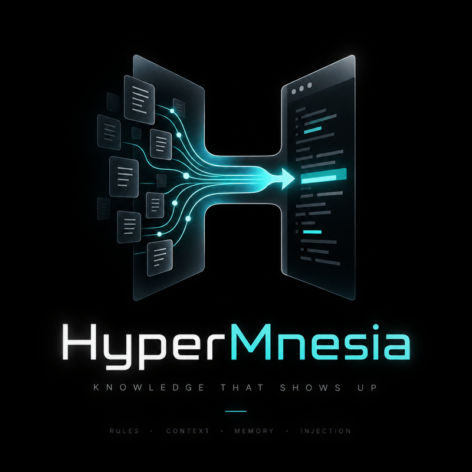
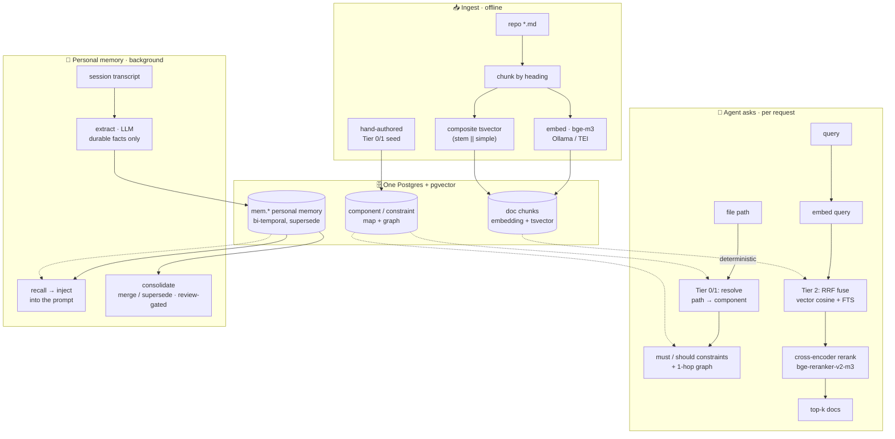

<p align="center">
  
</p>

# HyperMnesia

[](https://github.com/Recluse/HyperMnesia/actions/workflows/ci.yml)
[](LICENSE)

*The opposite of amnesia* (Greek *hypermnesia* — abnormally complete recall). Self-hosted long-term
memory for AI coding agents — a
Postgres-backed store that gives an agent (Claude Code, or any MCP client) two things:

1. **Architectural memory (doc-RAG + Tier 0/1)** — your repos' docs made searchable, plus a
   deterministic *component -> constraint* model so the agent knows the rules that apply to a
   file **before** it edits, without a search.
2. **Personal memory** — durable facts/preferences/decisions distilled from work sessions and
   injected back automatically, so the agent stops re-learning the same things every session.

One store (Postgres + [pgvector](https://github.com/pgvector/pgvector)), local-model friendly
(embeddings via [Ollama](https://ollama.com) or [TEI](https://github.com/huggingface/text-embeddings-inference)),
MCP-native, no cloud dependency. Runs on a laptop, one server, or Kubernetes.

> Not a vector-DB wrapper. The value is the **delivery**: constraints for the file you're about
> to edit are injected by a **PreToolUse hook** (deterministic, unprompted — the agent doesn't
> have to think to ask), and personal memory is captured/recalled by hooks too — "storage is
> solved, injection isn't."

## How it works



- **Tier 2 search** fuses dense (bge-m3 embeddings, HNSW) and lexical (composite `tsvector`,
  works for code identifiers and non-English) via **Reciprocal Rank Fusion**, then an optional
  **cross-encoder reranker** ([bge-reranker-v2-m3](https://huggingface.co/BAAI/bge-reranker-v2-m3))
  reorders the top candidates (measured +0.16 recall@1 on our eval set).
- **Personal memory** is bi-temporal (event time vs ingestion time), **supersede-not-overwrite**
  (corrections don't destroy history), with an abstention gate (an irrelevant query returns
  nothing, not noise). A background pass consolidates near-duplicates; low-confidence merges wait
  in a review queue for you.
- **Capture/recall** run as Claude Code hooks: session profile injected at start, relevant
  memories injected per prompt, transcripts distilled to memories by a small LLM on a schedule.
- **Constraint injection** is a hook too: a `PreToolUse` hook (`hooks/arch_invariants.py`) resolves
  the file you're about to edit to its component and injects the applicable `must` invariants
  before the edit — so Tier 1 is delivered deterministically, not left to the agent to ask for.
- **Map freshness** is checkable: `ci/freshness.py` flags component globs that match no file
  (a moved file silently unhooking its constraints) and documents indexed at an older commit, so
  the map decays *loudly*, not silently.
- **The install is checkable too**: `ci/doctor.py` (and the `status` MCP tool, which runs the very
  same script) reports the faults that leave a *working-looking* system — an ANN index that was
  never built, so the dense leg sequential-scans forever; chunks with no embedding, findable only
  by the lexical leg; two embedding models in one table, whose vectors cannot be compared; a
  scope name that differs from the ingested one only in case, so no invariant ever resolves.
  None of those raises an error anywhere, which is exactly why they need a checker.
- **Nothing outward is unbounded.** Every child process the MCP server spawns is on a clock, a
  document comes back capped with an explicit truncation notice rather than 80k tokens of text,
  and the structural map is re-read on a TTL — a server process that lives for days used to serve
  the map it loaded on the day it started.
- **Failure never looks like an empty answer.** The recurring bug in a system like this is a
  silence that reads as a fact: search says "no results" when the embedder is down, a hook
  injects nothing because the query broke, an ingest indexes zero documents and then deletes the
  corpus it should have refreshed. So: `psql` runs with `ON_ERROR_STOP` (without it a failed
  query exits 0 and returns an empty string, indistinguishable from "nothing matched"); search
  announces when it fell back to lexical-only; recall says once per outage that memory did not
  answer; an empty enumeration refuses to write rather than emptying the store; and the
  consolidator reports a model that gave no verdict instead of recording it as "keep".

## Where code fits

HyperMnesia indexes **docs, the architecture map, and memory** — not code symbols. Live code
structure ("where is `foo` defined, who calls it") is best answered by a **language server**, which
already keeps a precise, always-fresh index and updates it as you type. Pair HyperMnesia with an
LSP-backed symbol MCP such as [Serena](https://github.com/oraios/serena): both run as MCP servers
in the same client, with no overlap —

| Agent's question | Answered by |
|---|---|
| where is a symbol defined / who calls it / its type | **Serena / LSP** (live, no re-embed) |
| what rules apply to this file, before I edit it | **HyperMnesia** Tier 0/1 |
| where's the doc, and what do I know about this project/owner | **HyperMnesia** Tier 2 + memory |

Live code → the LSP layer; anything you want to remember or that lives in prose → HyperMnesia.
See **[docs/ARCHITECTURE.md](docs/ARCHITECTURE.md)** for the full system picture, an example
`.mcp.json` pairing both, and how it relates to managed memory offerings.

## Components

| Path | What |
|------|------|
| `sql/` | schema: doc-RAG (`documents/components/constraints/relationships/chunks`) + personal memory (`mem.*`) |
| `ingest/` | markdown chunker, embedder (Ollama/TEI), hybrid RRF search, `mem_ops`; incremental re-ingest via `--known-hashes` (unchanged docs keep their embeddings) |
| `rerank/` | optional cross-encoder reranker service + search orchestrator |
| `hooks/` | Claude Code hooks: constraint inject (`arch_invariants`), profile inject, per-prompt recall, capture, extract, consolidate, reflect (per-project knowledge pages) |
| `ci/` | `doctor.py` — health check for the faults that leave a working-*looking* install; `freshness.py` — map-staleness / orphan-glob checker (run against a target repo); `check_graph_sql_parity.py` — keeps the Python and Rust copies of the graph query identical |
| `tests/` | DB-free contract tests, wired into CI: hook I/O, ingest enumeration, incremental ingest |
| `mcp-server/` | Rust MCP server exposing project map / constraints / search / memory / `status` tools |
| `deploy/` | docker-compose (single box) + Kubernetes manifests |
| `examples/` | an example structural-tier seed for a project |
| `skills/` | `onboard-project` — the six steps to connect a new repo; `just` — answer-only / audit mode (agent-readable skills) |

## Install

See **[docs/INSTALL.md](docs/INSTALL.md)** for the four deployment options (laptop, single
server, Kubernetes, CPU-only-minimal) and the hardware / OS / software requirements table.

TL;DR (single box):

```bash
cp deploy/docker/.env.example deploy/docker/.env   # edit
docker compose -f deploy/docker/docker-compose.yml up -d
psql "$DATABASE_URL" -f sql/schema.sql -f sql/schema_mem.sql
python ingest/ingest_repo.py /path/to/your/repo myrepo out.sql && psql "$DATABASE_URL" -f out.sql
python ingest/embed_chunks.py     # fill embeddings
```

Two flags worth knowing before your first run:

- `--walk` enumerates the tree directly instead of asking git. Needed when the corpus is
  `.gitignore`d (working notes, scratch docs), which `git ls-files` reports as an empty tree.
  Without it the ingester refuses rather than emitting an empty corpus — a full ingest opens
  with `DELETE FROM documents WHERE repo = <tag>`, so "empty" would mean "delete everything".
- `--known-hashes known.tsv` re-emits only new and changed documents. Chunks carry the
  embeddings, so a plain re-ingest after editing one file re-embeds the whole corpus. Produce
  the file with `psql -tAF$'\t' -c "SELECT path, content_hash FROM documents WHERE repo='myrepo'"`
  against the database you are about to load into — the emitted SQL asserts the two agree and
  aborts if they do not.

## Design docs

- [docs/ARCHITECTURE.md](docs/ARCHITECTURE.md) — the whole system: the LSP/code layer + HyperMnesia, how to pair them, and related work.
- [docs/DESIGN.md](docs/DESIGN.md) — architecture and the reasoning behind the tiers.
- [docs/MEMORY.md](docs/MEMORY.md) — the personal-memory model (bi-temporal, supersede, consolidation).
- [docs/COMPARISON.md](docs/COMPARISON.md) — where HyperMnesia fits vs. neighbours, and honest non-goals/limitations.
- [skills/onboard-project/SKILL.md](skills/onboard-project/SKILL.md) — connecting a repository: ingest, the Tier 0/1 map, pairing with Serena, verification, and what changes per deployment.
- [skills/just/SKILL.md](skills/just/SKILL.md) — `/just`: answer the question literally with read-only tools and stop; the contract is checkable from the tool log. Session-wide as "audit mode".

## License

MIT — see [LICENSE](LICENSE).
