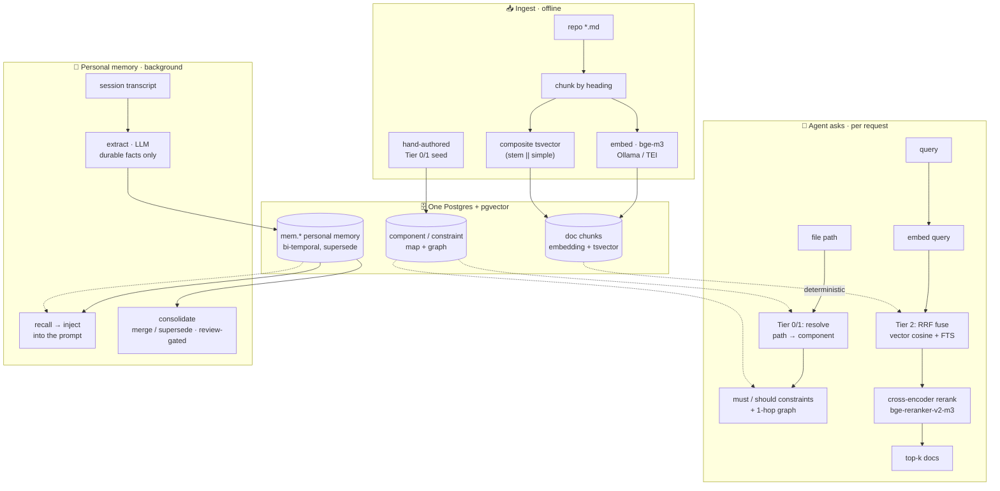

<p align="center">
  
</p>

# HyperMnesia

[](https://github.com/Recluse/HyperMnesia/actions/workflows/ci.yml)
[](LICENSE)

*The opposite of amnesia* (Greek *hypermnesia* — abnormally complete recall). Self-hosted long-term
memory for AI coding agents — a
Postgres-backed store that gives an agent (Claude Code, or any MCP client) two things:

1. **Architectural memory (doc-RAG + Tier 0/1)** — your repos' docs made searchable, plus a
   *component -> constraint* map that resolves a file path to the rules covering it, so the
   applicable invariants reach the agent **before** it edits, without a search.
2. **Personal memory** — durable facts, preferences and decisions distilled from work sessions
   and available in later ones, instead of being re-explained.

One store (Postgres + [pgvector](https://github.com/pgvector/pgvector)), local-model friendly
(embeddings via [Ollama](https://ollama.com) or [TEI](https://github.com/huggingface/text-embeddings-inference)),
no cloud dependency. Runs on a laptop, one server, or Kubernetes.

**Two interfaces, and they are not the same thing.** Search, the map and memory are exposed as
MCP tools, so any MCP client can *ask* for them. The automatic half — constraints injected before
an edit, memory recalled per prompt, sessions captured — is a set of **Claude Code hooks**.
Another client gets the data through the same tools, but only when the agent decides to call one,
which is the weakness the hooks exist to remove.

## Why

A coding agent repeats mistakes when the rule, the earlier decision or the stated preference is
not in its context at the moment it acts. Having it there is not a guarantee — an agent can be
handed a rule and break it anyway — but not having it guarantees the miss. Three common gaps:

- **The rule was written down and not read.** Your repo documents that only the data layer talks
  to Postgres. The agent opens a handler, writes a query, and the rule was two directories away
  in a file it had no reason to open. In that case it did not disobey; it never saw it.
- **You explain yourself again every session.** The preference you stated last week, the decision
  you took last month, the reason the old approach was abandoned — all of it left with the
  context window.
- **Search does not fire when it matters.** Retrieval only helps if something calls it, and an
  agent mid-edit does not stop to wonder whether it should. Storage is solved. Delivery is not.

The usual answer is one big instructions file, and it loses for a specific reason: every rule in
it costs tokens on every request whether or not the file being edited has anything to do with it,
so the file gets trimmed to the rules that apply everywhere — and those are the vaguest ones. It
also goes stale without saying so. Nothing tells you a path in it moved.

**The map here is written by hand too. What is automatic is the selection and the delivery.** You
author the components and their invariants once; from then on a file path is matched against the
component globs, and that component's `must` rules — plus those reached through one hop of the
dependency graph — are injected before the edit by a hook, rather than waited for. Documentation
and past decisions stay reachable behind that, by search.

A hand-authored map rots, so the rot is made visible rather than assumed away: globs that match
no file are reported, a store that will not answer says so instead of resembling a project with
no rules, and `./hm doctor` names the faults that leave an install working-*looking*.

If you want to see it rather than read about it: **[docs/DEMO.md](docs/DEMO.md)** — two minutes,
real output, no install beyond a Postgres.

## How it works



- **Tier 2 search** fuses dense (bge-m3 embeddings, HNSW) and lexical (composite `tsvector`,
  works for code identifiers and non-English) via **Reciprocal Rank Fusion**, then an optional
  **cross-encoder reranker** ([bge-reranker-v2-m3](https://huggingface.co/BAAI/bge-reranker-v2-m3))
  reorders the top candidates. (It measurably helped on a private evaluation set; the figure is
  in [eval/README.md](eval/README.md) with what it is and is not — one corpus, not a benchmark.)
- **Personal memory** is bi-temporal (event time vs ingestion time), **supersede-not-overwrite**
  (corrections don't destroy history), with an abstention gate (an irrelevant query returns
  nothing, not noise). A background pass consolidates near-duplicates; low-confidence merges wait
  in a review queue for you.
- **Capture/recall** run as Claude Code hooks: session profile injected at start, relevant
  memories injected per prompt, transcripts distilled to memories by a small LLM on a schedule.
- **Constraint injection** is a hook too: a `PreToolUse` hook (`hooks/arch_invariants.py`) resolves
  the file you're about to edit to its component and injects the applicable `must` invariants
  before the edit — so Tier 1 is delivered deterministically, not left to the agent to ask for.
- **Diagnostics, and what happens when something breaks.** A hand-authored map and a
  self-hosted store both fail in ways that still answer, so the failures are reported rather than
  inferred: `ci/freshness.py` flags globs matching no file and documents indexed at an older
  commit, and refuses a scope nothing is mapped under; `./hm doctor` (and the `status` MCP tool,
  which runs the same script) checks the ANN index, embedding coverage, model consistency and the
  scope name; search says when it fell back to lexical-only or to plain RRF order; a cached map
  carries its staleness and expires; an empty enumeration refuses to write rather than emptying
  the store. Each of those, and why it exists, is in
  **[docs/DIAGNOSTICS.md](docs/DIAGNOSTICS.md)**.
- **Timeouts, output limits and cache expiry.** Every child process the MCP server spawns is on a
  clock, a document comes back capped with the cut announced, and the structural map is re-read
  on a TTL rather than held for the life of the process.

## Where code fits

HyperMnesia indexes **docs, the architecture map, and memory** — not code symbols. Live code
structure ("where is `foo` defined, who calls it") is best answered by a **language server**, which
already keeps a precise index and updates it as you type. Pair HyperMnesia with an
LSP-backed symbol MCP such as [Serena](https://github.com/oraios/serena): both run as MCP servers
in the same client, with no overlap —

| Agent's question | Answered by |
|---|---|
| where is a symbol defined / who calls it / its type | **Serena / LSP** (live, no re-embed) |
| what rules apply to this file, before I edit it | **HyperMnesia** Tier 0/1 |
| where's the doc, and what do I know about this project/owner | **HyperMnesia** Tier 2 + memory |

Live code → the LSP layer; anything you want to remember or that lives in prose → HyperMnesia.
See **[docs/ARCHITECTURE.md](docs/ARCHITECTURE.md)** for the full system picture, an example
`.mcp.json` pairing both, and how it relates to managed memory offerings.

## Components

| Path | What |
|------|------|
| `hm` | one wrapper over the documented steps: `init` (compose + schema), `ingest` (ingest -> embed -> ANN index, incremental when the scope already exists), `doctor` |
| `sql/` | schema: doc-RAG (`documents/components/constraints/relationships/chunks`) + personal memory (`mem.*`) |
| `ingest/` | markdown chunker, embedder (Ollama/TEI), hybrid RRF search, `mem_ops`; incremental re-ingest via `--known-hashes` (unchanged docs keep their embeddings) |
| `rerank/` | optional cross-encoder reranker service + search orchestrator |
| `hooks/` | Claude Code hooks: constraint inject (`arch_invariants`), profile inject, per-prompt recall, capture, extract, consolidate, reflect (per-project knowledge pages) |
| `ci/` | `doctor.py` — health check for the faults that leave a working-*looking* install; `latency.py` — where the time goes (hook, embedder, database, reranker); `freshness.py` — map-staleness / orphan-glob checker (run against a target repo); `check_graph_sql_parity.py` — keeps the Python and Rust copies of the graph query identical |
| `tests/` | contract tests, all wired into CI: hook I/O, ingest enumeration, incremental ingest, chunk bounds, glob parity, query hygiene, `doctor`, `hm ingest` — all DB-free except `test_memory_sql.py`, which asserts the `mem.*` view (supersede, validity window) and the abstention gate against a live pgvector, with no embedder |
| `mcp-server/` | Rust MCP server exposing project map / constraints / search / memory / `status` tools |
| `deploy/` | docker-compose (single box) + Kubernetes manifests |
| `examples/` | an example structural-tier seed for a project |
| `skills/` | `onboard-project` — the six steps to connect a new repo; `just` — answer-only / audit mode (agent-readable skills) |

## Install

See **[docs/INSTALL.md](docs/INSTALL.md)** for the four deployment options (laptop, single
server, Kubernetes, CPU-only-minimal) and the hardware / OS / software requirements table.

TL;DR (single box). This ends at the first thing you can *see*: an invariant arriving before an
edit.

```bash
cp deploy/docker/.env.example deploy/docker/.env   # POSTGRES_PASSWORD: openssl rand -hex 24
./hm init                          # compose up, wait for Postgres, load both schemas
export DATABASE_URL=...            # init prints the exact line
./hm ingest /path/to/your/repo myrepo    # ingest -> embed -> ANN index -> doctor
```

`hm` is the recommended path because the *order* of those steps is load-bearing and getting it
wrong is silent: the ANN index must be built after the first bulk embed, and a re-ingest without
a known-hashes snapshot deletes the scope's documents and every embedding with them.
[docs/INSTALL.md](docs/INSTALL.md) has the same steps by hand, the non-Docker and Kubernetes
paths, and the flags (`--walk`, `--known-hashes`) that matter on later runs.

Documents alone are the cheap half. What pays is the Tier 0/1 map — which files belong to which
component, and which rules must hold for them — and nothing can generate it honestly from a
directory listing. Seed one from [examples/seed_example.sql](examples/seed_example.sql), point
your MCP client at `mcp-server` and register the hooks
([docs/INSTALL.md](docs/INSTALL.md#mcp-client)), and then watch a rule arrive before an edit:

```bash
printf '{"hook_event_name":"PreToolUse","tool_name":"Edit","cwd":"%s",
        "tool_input":{"file_path":"%s/src/api/users.py"}}' "$PWD" "$PWD" \
  | HM_REPO=myapp python3 hooks/arch_invariants.py
```

If that prints a `hookSpecificOutput` block naming your invariant, the whole chain works.
**[docs/DEMO.md](docs/DEMO.md)** walks the same path in two minutes with real output.

## Design docs

- [docs/ARCHITECTURE.md](docs/ARCHITECTURE.md) — the whole system: the LSP/code layer + HyperMnesia, how to pair them, and related work.
- [docs/DESIGN.md](docs/DESIGN.md) — architecture and the reasoning behind the tiers.
- [docs/MEMORY.md](docs/MEMORY.md) — the personal-memory model (bi-temporal, supersede, consolidation).
- [docs/COMPARISON.md](docs/COMPARISON.md) — where HyperMnesia fits vs. neighbours, and honest non-goals/limitations.
- [skills/onboard-project/SKILL.md](skills/onboard-project/SKILL.md) — connecting a repository: ingest, the Tier 0/1 map, pairing with Serena, verification, and what changes per deployment.
- [skills/just/SKILL.md](skills/just/SKILL.md) — `/just`: answer the question literally with read-only tools and stop; the contract is checkable from the tool log. Session-wide as "audit mode".

## License

MIT — see [LICENSE](LICENSE).
